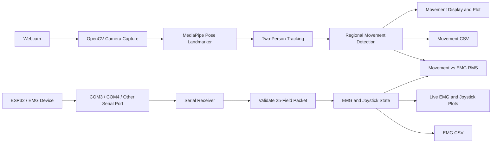

# Visual Movement Detection with EMG and Joystick Integration

A real-time research application for detecting body movement through a webcam and comparing it with live dual-channel EMG and joystick data from an ESP32 or compatible serial device.

The project combines computer vision, body-pose tracking, EMG acquisition, and synchronized data logging. It is intended for movement analysis, rehabilitation research, assistive-technology experiments, and human-computer interaction studies.

## Overview

The application uses OpenCV for camera capture and user-interface windows, MediaPipe Pose Landmarker for body tracking, serial communication for EMG data, and CSV files for research data collection.

It has two operating modes:

1. **Visual Motion Only** — webcam movement detection without EMG hardware.
2. **Visual Motion + EMG Hardware** — webcam movement detection plus live serial EMG and joystick data.

## System Flow



## Features

- Tracks up to **two people** in real time.
- Detects motion in the head, eyes, arms, torso, and legs.
- Labels each region as `MOVING`, `STATIONARY`, or `UNCERTAIN`.
- Uses landmark smoothing, body-size normalization, and hysteresis to reduce false detections.
- Supports camera-only and camera + EMG operating modes.
- Receives real EMG and joystick data from COM3, COM4, or other detected serial ports.
- Shows `COM NOT CONNECTED`, `WAITING FOR DATA`, `RECEIVING DATA`, and `DATA STOPPED` states.
- Plots raw EMG channel 1, raw EMG channel 2, EMG RMS, joystick X/Y, and joystick button state.
- Ignores malformed serial packets so invalid data cannot create false graphs.
- Records movement, EMG, and joystick data to CSV files.

## Requirements

### Hardware

- Webcam
- Optional ESP32 or compatible serial EMG device
- USB data cable for the EMG device

### Software

- Python 3.10+
- OpenCV
- MediaPipe
- NumPy
- PySerial

Install dependencies:

```bash
pip install opencv-python mediapipe numpy pyserial
```

## Project Structure

```text
Visual-Movement-Detection/
├── main.py
├── README.md
├── models/
│   └── pose_landmarker_full.task
└── data/
    ├── movement_data_YYYYMMDD_HHMMSS.csv
    └── emg_data_YYYYMMDD_HHMMSS.csv
```

## Pose Model

Place a compatible MediaPipe Pose Landmarker model here:

```text
models/pose_landmarker_full.task
```

The application expects this exact path relative to `main.py`.

## How to Run
