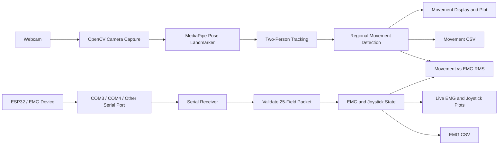

# Visual Movement Detection with EMG and Joystick Integration

A real-time research application for detecting body movement through a webcam and comparing it with live dual-channel EMG and joystick data from an ESP32 or compatible serial device.

The project combines computer vision, body-pose tracking, EMG acquisition, and synchronized data logging. It is intended for movement analysis, rehabilitation research, assistive-technology experiments, and human-computer interaction studies.

## Overview

The application uses OpenCV for camera capture and user-interface windows, MediaPipe Pose Landmarker for body tracking, serial communication for EMG data, and CSV files for research data collection.

It has two operating modes:

1. **Visual Motion Only** — webcam movement detection without EMG hardware.
2. **Visual Motion + EMG Hardware** — webcam movement detection plus live serial EMG and joystick data.

## System Flow



## Features

- Tracks up to **two people** in real time.
- Detects motion in the head, eyes, arms, torso, and legs.
- Labels each region as `MOVING`, `STATIONARY`, or `UNCERTAIN`.
- Uses landmark smoothing, body-size normalization, and hysteresis to reduce false detections.
- Supports camera-only and camera + EMG operating modes.
- Receives real EMG and joystick data from COM3, COM4, or other detected serial ports.
- Shows `COM NOT CONNECTED`, `WAITING FOR DATA`, `RECEIVING DATA`, and `DATA STOPPED` states.
- Plots raw EMG channel 1, raw EMG channel 2, EMG RMS, joystick X/Y, and joystick button state.
- Ignores malformed serial packets so invalid data cannot create false graphs.
- Records movement, EMG, and joystick data to CSV files.

## Requirements

### Hardware

- Webcam
- Optional ESP32 or compatible serial EMG device
- USB data cable for the EMG device

### Software

- Python 3.10+
- OpenCV
- MediaPipe
- NumPy
- PySerial

Install dependencies:

```bash
pip install opencv-python mediapipe numpy pyserial
```

## Project Structure

```text
Visual-Movement-Detection/
├── main.py
├── README.md
├── models/
│   └── pose_landmarker_full.task
└── data/
    ├── movement_data_YYYYMMDD_HHMMSS.csv
    └── emg_data_YYYYMMDD_HHMMSS.csv
```

## Pose Model

Place a compatible MediaPipe Pose Landmarker model here:

```text
models/pose_landmarker_full.task
```

The application expects this exact path relative to `main.py`.

## How to Run

Open a terminal in the project folder:

```bash
cd path/to/Visual-Movement-Detection
```

Run the application:

```bash
python main.py
```

On Windows PowerShell:

```powershell
python .\main.py
```

If Python is installed in a custom location:

```powershell
& "C:\Path\To\Python\python.exe" .\main.py
```

At launch, select **Visual Motion Only** or **Visual Motion + EMG Hardware**. In EMG mode, provide a port such as `COM3` or `COM4`, or leave it blank to scan available serial ports. The default baud rate is `115200`.

## ESP32 Serial Packet Format

The device must send one newline-terminated CSV row containing exactly 25 values:

```text
seq,timestamp_ms,emg1_0,emg1_1,...,emg1_9,emg2_0,emg2_1,...,emg2_9,joy_x,joy_y,btn
```

Example:

```text
1,1000,510,512,509,515,508,511,514,510,513,509,498,500,497,502,499,501,503,498,500,497,2048,2048,0
```

| Field | Description |
| --- | --- |
| `seq` | Device packet sequence number |
| `timestamp_ms` | Device timestamp in milliseconds |
| `emg1_0`–`emg1_9` | Ten EMG samples from channel 1 |
| `emg2_0`–`emg2_9` | Ten EMG samples from channel 2 |
| `joy_x` / `joy_y` | Joystick position values |
| `btn` | Joystick button state |

Only valid packets are plotted. If the port is open but no valid packets arrive, the display reports `WAITING FOR DATA`.

## Controls

| Key | Action |
| --- | --- |
| `R` | Start or stop CSV recording |
| `Tab` | Select the next tracked person |
| `0` | No trial |
| `1` | Still |
| `2` | Right arm |
| `3` | Left arm |
| `4` | Head |
| `5` | Right leg |
| `6` | Left leg |
| `7` | Whole body |
| `8` | Sitting still |
| `9` | Lying still |
| `S` | Lying sideways still |
| `Q` or `Esc` | Exit |

## Output Data

The program creates the `data/` folder when recording begins.

- `movement_data_*.csv` contains timestamps, frame number, track ID, trial label, region motion values, observability, and movement states.
- `emg_data_*.csv` contains timestamps, sequence number, raw EMG samples, joystick data, and button state.

Both streams use PC-side timestamps, so they can be aligned during later analysis.

## Display Windows

The main window shows the webcam feed, pose skeleton, movement state, movement plot, EMG RMS comparison plot, time, and COM/data status.

When EMG mode is active, a second window displays raw EMG channel 1, raw EMG channel 2, and joystick X/Y/button data.

## Troubleshooting

### COM NOT CONNECTED

Check that the ESP32 is connected, the correct port is selected, the USB cable supports data, and no other program is using the port. Close Arduino Serial Monitor before running this application.

### WAITING FOR DATA

The serial port is open but the device is not sending valid 25-field packets. Confirm that the ESP32 firmware uses the packet format above and that its baud rate matches the application.

### Pose model not found

Confirm that `models/pose_landmarker_full.task` exists beside `main.py`.

### Camera cannot be opened

Change this setting in `main.py`:

```python
CAMERA_INDEX = 0
```

Try `CAMERA_INDEX = 1` if another webcam is connected.

## Notes

- Person IDs are only maintained for short frame-to-frame continuity. They may change after a person leaves the frame, is fully occluded, or crosses closely with someone else.
- Movement thresholds may need recalibration for a different camera, lighting condition, participant, or recording distance.
- EMG interpretation depends on the quality of the hardware, electrode placement, filtering, and firmware sampling design.

## Future Improvements

- GUI serial-port and baud-rate selection
- Pre-recording camera and hardware check
- Video recording synchronized with CSV data
- Saved configuration profiles
- Automated post-session analysis reports
- More robust long-term person identification

## References: Visual Movement Detection

1. Google AI Edge. *MediaPipe Pose Landmarker for Python*. The project uses MediaPipe Pose landmarks for body-region tracking and movement measurement.  
   https://ai.google.dev/edge/mediapipe/solutions/vision/pose_landmarker/python

2. Lugaresi, C., Tang, J., Nash, H., et al. (2019). *MediaPipe: A Framework for Building Perception Pipelines*. arXiv:1906.08172.  
   https://arxiv.org/abs/1906.08172

3. Bazarevsky, V., Grishchenko, I., Raveendran, K., Zhu, T., Zhang, F., & Grundmann, M. (2020). *BlazePose: On-device Real-time Body Pose Tracking*. arXiv:2006.10204.  
   https://arxiv.org/abs/2006.10204

4. Bradski, G. (2000). *The OpenCV Library*. Dr. Dobb's Journal of Software Tools. OpenCV is used for webcam capture, skeleton drawing, live plots, and application windows.  
   https://opencv.org/

## License

Add a license file before distributing this project publicly. The MIT License is a common choice for open-source projects.
